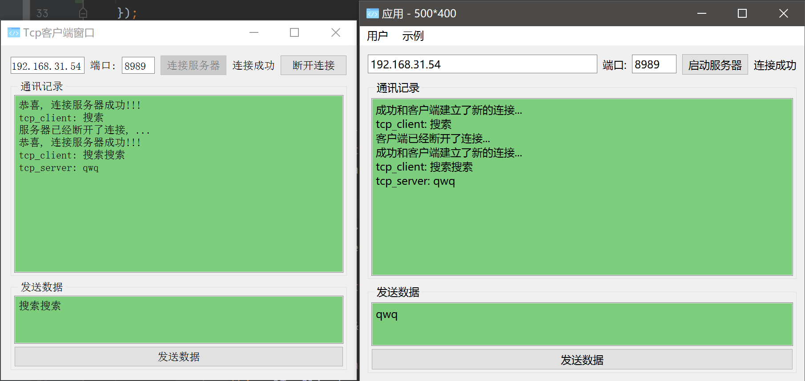
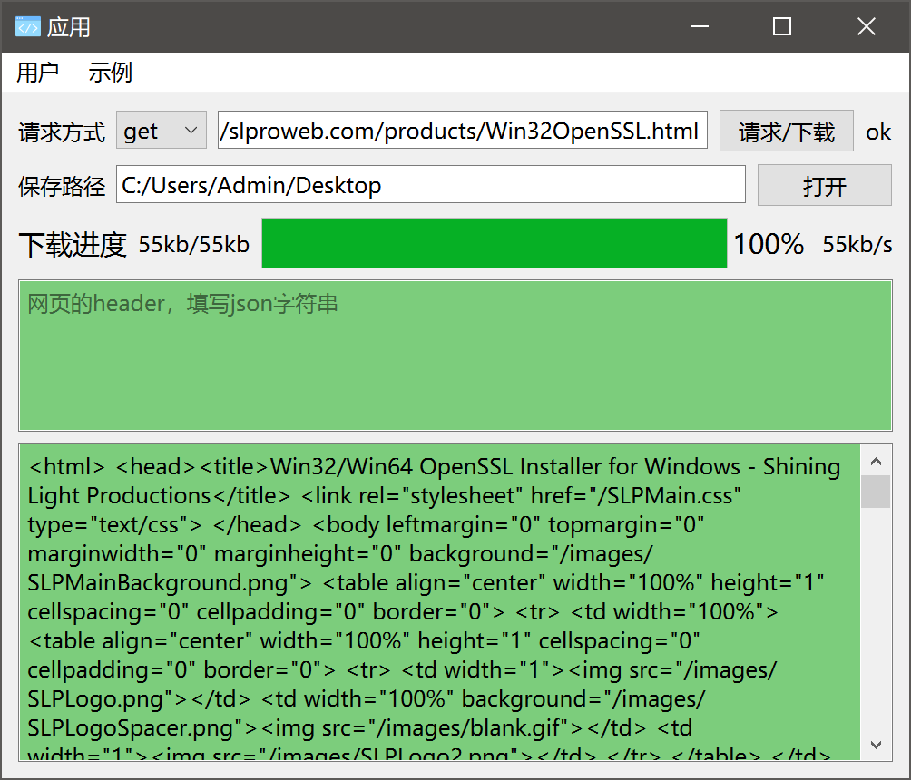
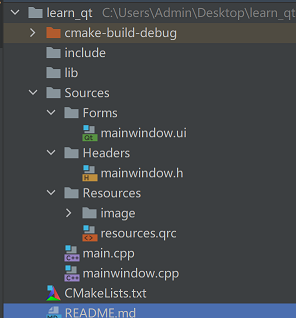

# 学习 qt c++

😉在Clion中快速开始c++QT项目，具有良好的项目路径

- 快速编写新功能
    - 单独在 `src/Forms文件夹` 里创建一个 `QWidget.ui`
    - 使用 `qt_designer` 编辑ui文件
    - 然后在 `mainwindow` 里面将 `main_layout` 指向这个 `QWidget` 即可


- 示例1：tcp服务器_客户端
    - 
- 示例2：请求网页下载文件并显示进度
    - 还没有实现下面两个功能，已经在代码里面标记了
    - 你可以完成下面的功能来检验自己是否能看懂这个项目
    - TODO 1 请求附带 `header`
    - TODO 2 根据 `combox` 更改请求方式
    - 

## 0.项目目录

> 一个好的结构可以让项目更好和更容易的编写下去

> 需要先约定一下各个文件目录的作用

- `src文件夹`用于保存所有的qt源文件
    - `Forms文件夹`存放UI文件
    - `Headers文件夹`存放.h头文件
    - `res文件夹`存放.qrc以及资源文件
    - cpp文件直接放在src目录下
        - 将cpp里面导入ui的前面加上`Forms/`
        - 第一次会报错，但是编译后就可以正常运行了
        - 例如`#include "Forms/ui_MainWindow.h"`
- `include文件夹`存放第三方库的头文件



## 1.环境配置

> 项目是否能够正常启动往往是拦路虎

> 这里下载安装的版本是Qt5.14.2，里面选择exe结尾的即可
> `https://mirrors.ustc.edu.cn/qtproject/archive/qt/5.14/5.14.2/`

> 需要知道`qt的安装路径`
> 例如：`C:/Qt/Qt5.14.2/5.14.2/mingw73_64/bin`

0. 添加https支持
    - 如果不进行这一步，就下载和访问不了https的文件
    - 下载 `http://slproweb.com/products/Win32OpenSSL.html` 里面的 `Win64 OpenSSL v1.1.1s Light`
    - 安装步骤里面选择的时候选择复制到安装路径下
    - 安装结束后到这个软件的安装路径下找到 `libcrypto-1_1-x64.dll` 和 `libssl-1_1-x64.dll` 文件
    - 将 `libcrypto-1_1-x64.dll` 和 `libssl-1_1-x64.dll` 移动到 `qt的安装路径` 中
0. 添加环境变量 `qt的安装路径`
1. 将clion的编译(锤子旁边的属性里面work路径改为 `qt的安装路径` )
    - 具体可以看图片[change_run_work_path.png](./docs/change_run_work_path.png)
2. 在clion设置中添加external_tools，需要写上5个参数点击 `ok`
    - 具体可以看图片[add_external_tools.png](./docs/add_external_tools.png)

3. cmake文件

```cmake
cmake_minimum_required(VERSION 3.19)
project(learn_qt)

set(CMAKE_CXX_STANDARD 14)
# 添加c++额外参数
set(CMAKE_EXE_LINKER_FLAGS "-static-libgcc -static-libstdc++")
set(CMAKE_AUTOMOC ON)
set(CMAKE_AUTORCC ON)
set(CMAKE_AUTOUIC ON)
set(QT_VERSION 5)
set(REQUIRED_LIBS Core Gui Widgets)
set(REQUIRED_LIBS_QUALIFIED Qt5::Core Qt5::Gui Qt5::Widgets)
find_package(Qt${QT_VERSION} COMPONENTS ${REQUIRED_LIBS} REQUIRED)

# 导入的头文件
include_directories(
        ${PROJECT_SOURCE_DIR}/include
        ${PROJECT_SOURCE_DIR}/src/Headers
)

# 每次添加新的文件可以在clion里面右击 `CMakeLists.txt` 文件，选择 `Reload CMake Project`
# 从而不需要修改这里面的内容
file(GLOB DIR "src/*.cpp" "src/Headers/*.h" "src/Forms/*.ui" "src/res/*.qrc")
add_executable(${PROJECT_NAME}
        # WIN32 # 不要程序有黑色的命令行出现，但是加上这个就不能qDebug()了，TODO 可以发布的时候修改这里
        ${DIR})

target_link_libraries(${PROJECT_NAME} ${REQUIRED_LIBS_QUALIFIED})
```

4. 点击运行

## 2.发布

```bash
# 将编译后的单独的exe文件复制到新的路径下
# 命令行输入
windeployqt xxx.exe
# 将 `libcrypto-1_1-x64.dll` 和 `libssl-1_1-x64.dll` 移动到这个文件夹中
# 压缩后就可以发布
```

## 参考链接

- 感谢下面的文章，使我从中汲取了灵感，来编写这个项目
- 下面的文章并不是完全正确的，我只是截取中间的某些部分，具体系统学习的话还是看官方文档比较好

- [基于 TCP 的 Qt 网络通信](https://subingwen.cn/qt/socket-tcp/) 
- [Qt事件](https://subingwen.cn/qt/event_handler)
- [QUrl介绍](https://blog.csdn.net/u012260238/article/details/53944984)
- [QT QString根据路径获取文件名称以及所在文件夹等信息](https://blog.csdn.net/weixin_37113987/article/details/61196128)
- [Qt拼接文件路径方式总结](https://blog.csdn.net/zyhse/article/details/109247472)
- [Qt关于路径的处理](https://blog.csdn.net/qq_41949352/article/details/121717235)
- [Qt QNetwork 下载文件](https://blog.csdn.net/weixin_42837024/article/details/120433799)
- [Qt笔记25：QFile读写中文乱码：指定文件编码方式](https://blog.csdn.net/weixin_42962516/article/details/117014630)
- [Qt实现读取、显示、修改并保存txt文件](https://blog.csdn.net/weixin_43784250/article/details/89185744)
- [在字符串中检索字符串是否存在](https://blog.csdn.net/chen_yi_long/article/details/8147645)
- [Qt中使用QFileDialog中选择文件夹/目录](https://blog.csdn.net/weixin_39308337/article/details/115259831)
- [qt获取桌面路径（暂定应用Windows）](https://blog.csdn.net/sono_io/article/details/119252122)
- [qint64转为qstring qt_Qt中Qstring,char,int,QByteArray之间到转换](https://blog.csdn.net/weixin_39866966/article/details/111480995)
- [Qt的QFile](https://blog.csdn.net/qq_38832450/article/details/102537130)
- [QT https post请求（QNetworkRequest要设置SSL证书，而SSL证书认证有三种）](https://www.cnblogs.com/jk-Huan/p/8953541.html)
- [Qt学习笔记一：Qt使用network模块进行http请求时获取response中的http状态码](https://blog.csdn.net/chexiaohui6306/article/details/100924225)
- [Qt使用QSettings保存和读取用户信息](https://blog.csdn.net/nchu_zhangyiqing/article/details/109716113)
- [QT中全局变量的定义和使用](https://blog.csdn.net/u011555996/article/details/108110996)
- [Qt开发经验](https://gitee.com/feiyangqingyun/qtkaifajingyan)
- [QGridLayout示例及刷新布局](https://blog.csdn.net/qq_41605114/article/details/102638649)
- [【Qt】QIcon::fromTheme：从系统主题中获取图标](https://blog.csdn.net/u010168781/article/details/88558858)
- [QT 使用全局缩放进行全分辨率适配（QT_SCALE_FACTOR）](https://blog.csdn.net/u014410266/article/details/107488789)
- [003 - Clion 创建 Qt UI Class 踩坑](https://blog.csdn.net/zcteo/article/details/117558432)
- [Qt程序打包发布方法（使用官方提供的windeployqt工具）](https://blog.csdn.net/iw1210/article/details/51253458)
- [QT+CMake 发布应用时, 如何去掉控制台?](https://www.zhihu.com/question/453843402)
- [C++学习笔记 QT connect/disconnect与connect的五个参数](https://blog.csdn.net/NekoMiMiChtholly/article/details/106600692)
- [怎样解决Qt编译出的程序运行时缺少libgcc_s_dw2-1.dll 文件的问题？](https://blog.csdn.net/suda_lv/article/details/62046557)
- [如何在CLion里愉快的开发QT](https://blog.csdn.net/qq_31710315/article/details/122942280)

