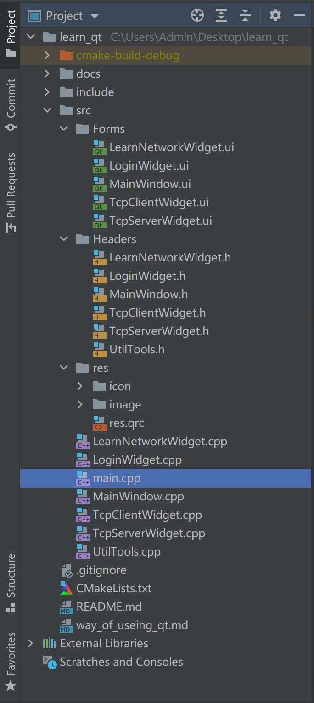

# 学习 qt c++

## 0.项目目录

> 为了目录结构的清晰，需要重构一下项目目录

- `src文件夹`用于保存所有的qt源文件
    - `Forms文件夹`存放UI文件
    - `Headers文件夹`存放.h头文件
    - `res文件夹`存放.qrc以及资源文件
    - cpp文件直接放在src目录下
        - 将cpp里面导入ui的前面加上`Forms/`
        - 第一次会报错，但是编译后就可以正常运行了
        - 例如`#include "Forms/ui_MainWindow.h"`
- `lib文件夹`存放第三方库.dll文件和.a文件
- `include文件夹`存放第三方库的头文件



## 1.环境配置

> 需要知道qt的安装路径
> 例如：`C:/Qt/Qt5.14.2/5.14.2/mingw73_64/bin`

0. 添加环境变量qt的安装路径
1. 将clion的编译(锤子旁边的属性里面work路径改为qt的安装路径)
2. 在clion设置中添加external_tools，需要协商5个参数点击ok
    - 具体可以看图片[add_external_tools.png](./docs/add_external_tools.png)

3. cmake文件

```cmake
cmake_minimum_required(VERSION 3.19)
project(learn_qt)

set(CMAKE_CXX_STANDARD 14)
# 添加c++额外参数
set(CMAKE_EXE_LINKER_FLAGS "-static-libgcc -static-libstdc++")
set(CMAKE_AUTOMOC ON)
set(CMAKE_AUTORCC ON)
set(CMAKE_AUTOUIC ON)
set(QT_VERSION 5)
set(REQUIRED_LIBS Core Gui Widgets)
set(REQUIRED_LIBS_QUALIFIED Qt5::Core Qt5::Gui Qt5::Widgets)
find_package(Qt${QT_VERSION} COMPONENTS ${REQUIRED_LIBS} REQUIRED)

# 导入的头文件
include_directories(
        ${PROJECT_SOURCE_DIR}/include
        ${PROJECT_SOURCE_DIR}/src/Headers
)

file(GLOB DIR "src/*.cpp" "src/Headers/*.h" "src/Forms/*.ui")
add_executable(${PROJECT_NAME}
        WIN32 # 不要程序有黑色的命令行出现
        ${DIR})

target_link_libraries(${PROJECT_NAME} ${REQUIRED_LIBS_QUALIFIED})
```

4. 点击运行

## 2.发布

```bash
# 将编译后的单独的exe文件复制到新的路径下
# 命令行输入
windeployqt xxx.exe
# 压缩后就可以发布
```